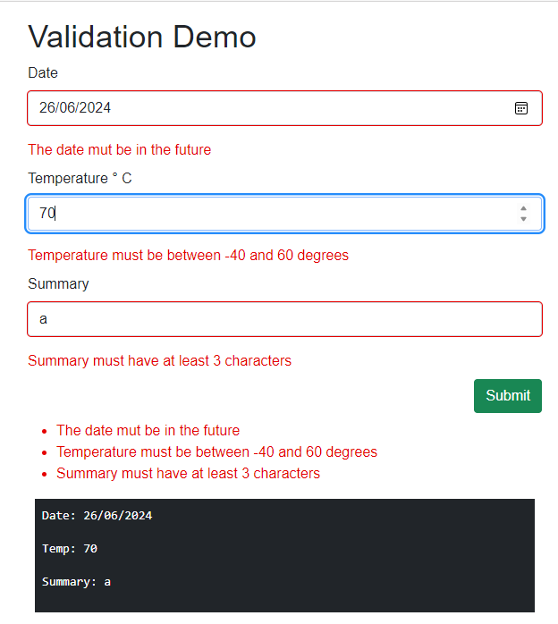

# Blazr.FluentValidation

This Repo contains the source and demo code for my simple Fluent Validation implementation.

## Installation

Install the following Nuget packages:

- Blazr.FluentValidation
- FluentValidation

## Usage

> The *Blazr.FluentValidation.Server* project in the repo is a Demo site.

Define a Validator for the edit class.

```csharp
using FluentValidation;

public class WeatherForecast
{
    public DateOnly Date { get; set; }
    public int TemperatureC { get; set; }
    public string? Summary { get; set; }
    public int TemperatureF => 32 + (int)(TemperatureC / 0.5556);
}

public class WeatherForecastValidator : AbstractValidator<WeatherForecast>
{
    public WeatherForecastValidator()
    {
        this.RuleFor(p => p.Summary)
            .NotNull().WithMessage("You must enter a Summary of at lest 3 characters")
            .MinimumLength(3).WithMessage("Summary must have at least 3 characters")
            .WithState(p => p);

        this.RuleFor(p => p.TemperatureC)
            .GreaterThanOrEqualTo(-40).WithMessage("Temperature must be between -40 and 60 degrees")
            .LessThanOrEqualTo(60).WithMessage("Temperature must be between -40 and 60 degrees")
            .WithState(p => p);

        this.RuleFor(p => p.Date)
            .GreaterThan(DateOnly.FromDateTime(DateTime.Now))
            .WithMessage("The date mut be in the future")
            .WithState(p => p);
    }
}
```

Add the `BlazrFluentValidator` component to the `EditForm`.

```csharp
@page "/"
@using Blazr.FluentValidation
<PageTitle>Home</PageTitle>

<h1>Validation Demo</h1>

<EditForm Model="_model" OnValidSubmit="this.OnValidSubmit">
    <BlazrFluentValidator TRecord="WeatherForecast" TValidator="WeatherForecastValidator" />

    <div class="mb-2">
        <label class="form-label">Date</label>
        <InputDate class="form-control mb-3" @bind-Value="_model.Date" />
        <ValidationMessage For="() => _model.Date" />
    </div>

    <div class="mb-2">
        <label class="form-label">Temperature &deg; C</label>
        <InputNumber class="form-control mb-3" @bind-Value="_model.TemperatureC" />
        <ValidationMessage For="() => _model.TemperatureC" />
    </div>

    <div class="mb-2">
        <label class="form-label">Summary</label>
        <InputText class="form-control mb-3" @bind-Value="_model.Summary" />
        <ValidationMessage For="() => _model.Summary" />
    </div>

    <div class="text-end mb-2">
        <button class="btn btn-success" type="submit">Submit</button>
    </div>

    <ValidationSummary />

</EditForm>

<div class="bg-dark text-white m-2 p-2">
    <pre>Date: @_model.Date.ToShortDateString()</pre>
    <pre>Temp: @_model.TemperatureC</pre>
    <pre>Summary: @_model.Summary</pre>
</div>

@code {
    private WeatherForecast _model = new();

    private void OnValidSubmit()
    {

    }
}
```


